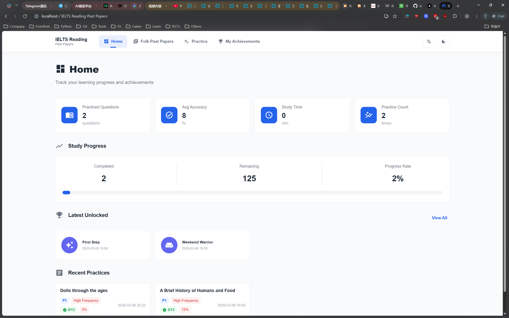
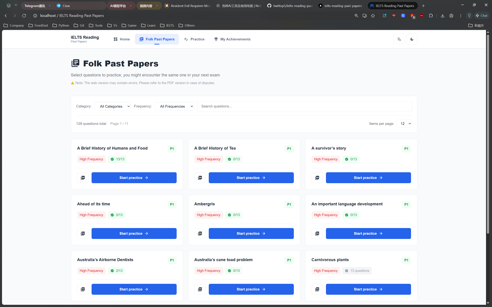

## IELTS Reading Past Papers

> [中文版](./README.md)

 | Live Demo: [https://ielts-reading-past-papers.vercel.app](https://ielts-reading-past-papers.vercel.app)

An IELTS Reading practice app featuring question bank browsing, practice mode, history, achievements, i18n, and theme switching. The question bank is stored as static HTML/PDF under `public/questionBank` and loaded via a prebuilt index.

### Screenshots
| Home | Browse |
| :-: | :-: |
|  |  |

### Features
- Browse by category (P1/P2/P3) and frequency (High/Low), with search and filters
- Practice mode with embedded HTML, full-screen immersive experience, automatic time tracking, scoring, and loading state indicators with timeout handling
- Practice history with score, accuracy, and duration, supporting full data JSON import/export (backup & restore)
- Achievements with automatic unlock, featuring beautiful notification popups and a dedicated showcase page
- Internationalization (Chinese/English), including 404 page
- Light/Dark theme powered by CSS variables
- PDF viewing (same folder as HTML; allow popups in your browser)

### Data Backup & Restore
- **Full Backup**: Export all local data (practice history, achievements, settings) as a JSON file.
- **Lossless Restore**: When importing a JSON file, the system performs version validation and data integrity checks to ensuring 100% restoration of user data.
- **Cross-Device Migration**: Easily migrate your learning progress from one device to another using the import/export feature.
- **Data Privacy**: All data is stored locally in your browser (localStorage). We do not collect any personal information.

### Tech Stack
- Vue 3, TypeScript, Vite
- Pinia (state), Vue Router (routing)
- Ant Design Vue (UI feedback)

### Requirements
- Node.js ≥ 18
- npm

### Quick Start
```bash
npm install
npm run dev
npm run build
npm run preview
```

### Structure (excerpt)
```
public/
  questionBank/            # Static HTML/PDF
src/
  components/              # Reusable components
  layouts/                 # Layouts
  router/                  # Routes
  store/                   # Pinia stores
  styles/                  # Themes and globals
  utils/
    backup.ts              # Full data backup/restore utility
    questionIndex.json     # Prebuilt index of questions
    questionScanner.ts     # Build final question meta from index
    eventBus.ts            # Global event bus (achievements, updates)
  views/                   # Pages (Home/Browse/Practice/PracticeMode/...)
  i18n/index.ts            # Lightweight i18n (t, currentLang, setLocale)
```

### Data & Question Bank
- Questions live in `public/questionBank` and are copied to `dist/questionBank` at build time.
- Pages read `src/utils/questionIndex.json` for `htmlPath` entries, then `questionScanner.ts` enriches them (e.g., total questions).
- Do not remove `public/questionBank`. To reduce repo size, you may delete PDFs and hide the “View PDF” button.

### Update Index (questionIndex.json)
- Add a question
  1. Put HTML (and optional PDF) into `public/questionBank` under the proper folder (e.g., `1.P1 高频/`).
  2. Append a record to `src/utils/questionIndex.json` with fields: `id`, `title`, `titleCN`, `category` (`P1`/`P2`/`P3`), `difficulty` (`高频`/`次频`), and `htmlPath` starting with `/questionBank/...`.
  3. Build and run. The page will display it automatically.
- Remove a question: delete its files from `public/questionBank`, remove the record from the index, rebuild.
- Naming note: the PDF opener strips `【高】/【次】` from the HTML filename and appends `.pdf`. Keep names consistent.

### i18n
- Use `inject('t')` to get the translation function and `inject('currentLang')` to read current locale.
- Language persists in `localStorage: ielts-language`. Chinese subtitles are hidden in English mode for a clean UI.

### Build & Deploy
- `npm run build` outputs to `dist/` (including `dist/questionBank` copied from `public`).
- Deploy the entire `dist` folder to a static host (or platforms like Vercel).
- `dist/` is ignored by `.gitignore`.

### Commit Convention
- Follow Conventional Commits:
  - `feat:` new feature
  - `fix:` bug fix
  - `docs:` documentation
  - `style:` formatting
  - `refactor:` code refactor
  - `perf:` performance
  - `test:` tests
  - `chore:` tooling/build/deps

### License
- GNU GPLv3. See [LICENSE](./LICENSE).

